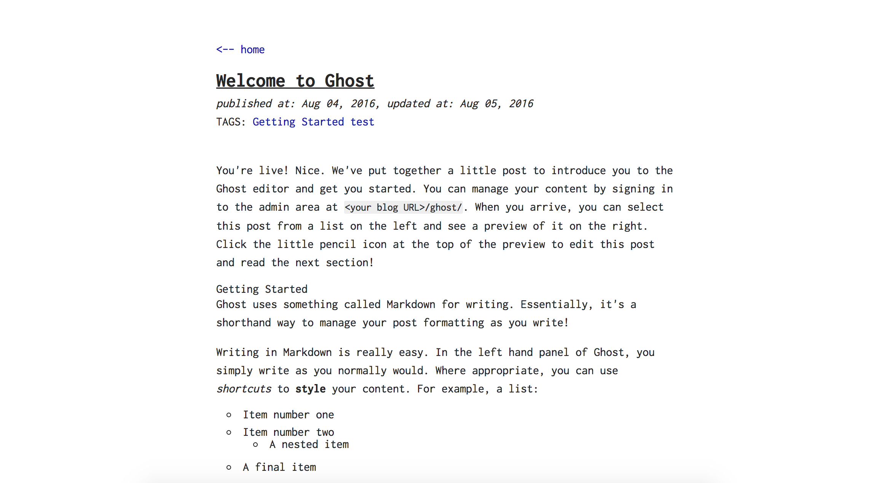

[](https://ghit.me/repo/jiahaowu/elegant)

# Elegant Theme for Ghost
This is a theme for ghost blog system, inspired by the basic theme of jekyll.

## Screenshots
Home page


Post Page


## Features
- Disqus integration
- MathJax support
- Code highlight

## Configuration

### Disqus Comment System

Use the Code Injection page to define the shortname in blog header for Disqus comments to enable this feature.
```
<script>
var disqus_shortname = 'YOUR_DISQUS_SHORTCUT_HERE';
</script>
```

